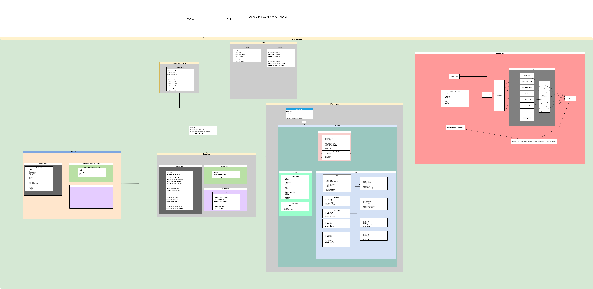

# E-commerce Backend with FastAPI
## Project Overview
- This project is an e-commerce backend built with FastAPI. It offers API endpoints for user management, product handling, order processing, and payment integration.

## Features
- User Authentication: Registration, login, and session management using JWT.
- Product Management: Create, Read, Update, and Delete (CRUD) operations for products.
- Order Processing: Efficient order creation and payment processing.
- Shopping Cart: Manage user shopping carts.
- Role-based Access Control: Differentiate access based on user roles (e.g., user, admin).
- API Documentation: Automatically generated documentation with Swagger UI and ReDoc.
## Tech Stack
### Backend (e_server)
- Programming Language: Python
- Database: PostgreSQL, MySQL, or SQLite (handles data storage and migrations)
- Authentication: JSON Web Tokens (JWT)
- File Storage: AWS S3 or local storage options
- Caching: Redis (optional)
- Task Queue: Celery with RabbitMQ
### Frontend (e_ui)
- Framework: Next.js
## Installation
### Prerequisites
- Python 3.8 or higher
- A database (PostgreSQL, MySQL, or SQLite)
- Redis (optional, for caching purposes)
## Setup Steps


### Clone the Repository

```bash
git clone https://github.com/vantoan2905/e-commerce_v2.git
cd e-commerce_v2
```
### Create a Virtual Environment

```bash
python -m venv venv
source venv/bin/activate  # On Windows: venv\Scripts\activate
```

### Backend Setup

- Navigate to the "e_server/c_con" directory.
- Install dependencies:

``` bash
pip install -r requirements.txt
```
### Configure Environment Variables

```bash
cp .env.example .env
```

Then,  the .env file with your database connection details and other required settings.

### Apply Database Migrations

```bash
alembic upgrade head
```

### Start the Application

```bash
uvicorn app.main:app --reload
```
### API Documentation
#### Once the server is running, access the API documentation at:

- Swagger UI: http://127.0.0.1:8000/docs

- ReDoc: http://127.0.0.1:8000/redoc
### Project Structure
```bash
📄 .gitignore
📄 README.md
📄 archive (4).zip
📁 c_con/
    📄 .env
    📄 README.md
    📄 requirements.txt
    📄 run.bat
    📁 src/
        📄 README.MD
        📁 api/
            📄 README.MD
            📄 image.png
            📁 product_api/
                📄 product_api.py
            📁 user_api/
                📄 user.py
        📁 database/
            📄 .gitignore
            📄 README.MD
            📄 __init__.py
            📄 base.py
            📄 database.py
            📄 database_diagram.png
            📁 models/
                📄 __init__.py
                📁 cart/
                    📄 cart.py
                    📄 cart_detail.py
                📁 product/
                    📄 product.py
                📁 transaction/
                    📄 transaction.py
                    📄 transaction_detail.py
                📁 user/
                    📄 user.py
                📁 user_product/
                    📄 favorite_product.py
                    📄 page_view.py
                    📄 product_view.py
                    📄 search_history.py
                    📄 tracking_data.py
                    📄 user_action.py
                    📄 user_session.py
        📁 dependencies/
            📄 __init__.py
            📄 dependencies.py
        📄 df_product.csv
        📄 main.py
        📁 migrations/
            📄 __init__.py
        📁 schemas/
            📄 __init__.py
            📄 product_schema.py
            📄 user_product_Interaction_schema.py
            📄 user_schema.py
        📄 seed_data.py
        📁 service/
            📁 product_service/
                📄 __init__.py
                📄 product_service.py
            📁 session_service/
                📄 session_service.py
            📁 user_service/
                📄 __init__.py
                📄 user_service.py
        📄 setup.bat
        📄 system_diagram.png
        📄 test.ipynb
        📄 users.csv
📄 clean_data.ipynb
📄 data.zip
📄 setup.bat
```


### Docker Support
#### Build the Docker Image
```bash
docker build -t ecommerce-fastapi .
```
#### Run the Docker Container
```bash
docker run -p 8000:8000 --env-file .env e-commerce_v2
```

## Data Files
### The project includes several CSV files for managing data:

- cameras.csv: Camera data.
- events.csv: Event data.
- products.csv: Product data.
- users.csv: User data.
## Testing
### Run tests using:

```bash
pytest
```
Contributing
### Fork the repository.
### Create a new branch for your feature or bug fix.
### Submit a pull request.
# License
- This project is licensed under the MIT License.

